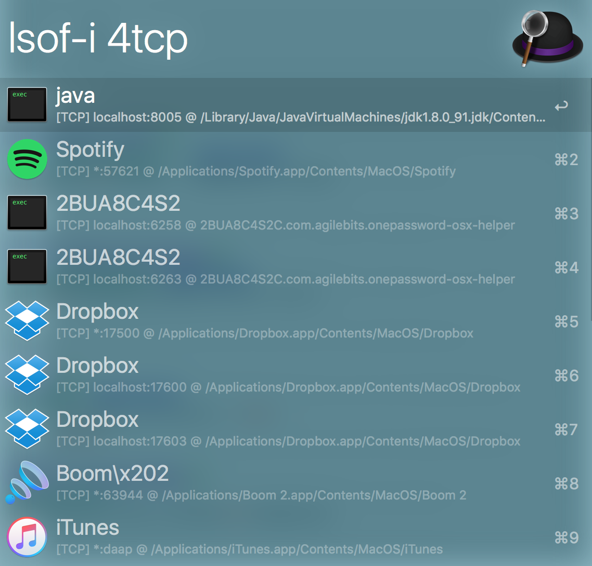
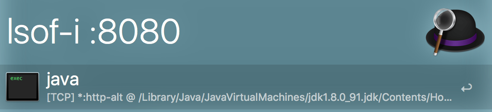

# alfred-lsof-i

An [Alfred](https://www.alfredapp.com/) 2/3 workflow that easily find and kill the process that is binding the given service name or port number

## Usage

1. Type `lsof-i [46][protocol][@hostname|hostaddr][:service|port]`
	- If nothing found by the given argument, It will try use `[:service|port]` to find again. Therefore it will still find the process if you just type a port number.
	- see more @ [LSOF(8) manual page -i option](https://developer.apple.com/legacy/library/documentation/Darwin/Reference/ManPages/man8/lsof.8.html)
	
2. Press return to kill the selected process.

[Alfred Workflows](http://www.alfredforum.com/topic/9277-what-is-binding-the-port/)

## License

[WTFPL](http://www.wtfpl.net/about/)
