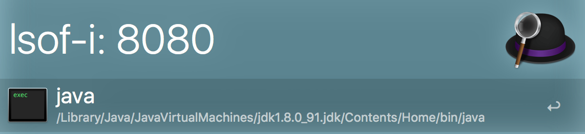

# alfred-lsof-i

An [Alfred](https://www.alfredapp.com/) 2/3 workflow that easily find and kill the process that is binding the given service name or port number

## Usage

1. Type `lsof-i: [service|port]`
	- ***service*** is an `/etc/services` name - e.g., smtp
	- ***port*** is a port number
2. Press return to kill the process.

## License

[WTFPL](http://www.wtfpl.net/about/)
